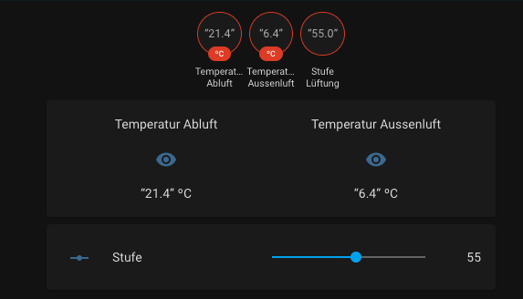

# Hoval Gateway (CAN Bus)


This repository contains a simple Gateway for Hoval ventilations and other applicances.
Most of the logic and the idea is from this repository: https://github.com/zittix/Hoval-GW 

Thanks a lot!

It is configured for a Hoval ventilation (HV) (mostly in German - i will change that soon). If you have another device you have to configure the datapoints in the *gateway/settings.py* and also change the device, datapoints can be read in *docs/datapoints.csv*.
If you need help setting up your devices make a new issue, i will help you.



## Features

- Read data and publish to mqtt server
- Create periodically task (needed e.g. for temperature sensors) for data requests
- Set data, subscribed by mqtt server

## Important
This repository is simply a demo and not for production use. Use with caution!

If you found any issues or improvements feel free to add pull requests or an issue!

## Setup required
### Hardware
1. Raspberry PI
2. CAN Transceiver and adapter (or simply a complete board e.g. PiCAN2 or [CanHat](https://www.waveshare.com/2-ch-can-hat.htm))

#### Pinout of RJ45 CAN
```
1: CAN-HIGH
2: CAN-LOW
7: GND
```

### Instructions
1. Install Raspbian
2. Install and setup CAN
```bash
# Update Raspbian
sudo apt-get update 
sudo apt-get upgrade 
sudo reboot 

sudo vim /boot/config.txt

# Add these 3 lines to the end of the file
dtparam=spi=on 
dtoverlay=mcp2515-can0,oscillator=16000000,interrupt=25 
dtoverlay=spi-bcm2835-overlay
#### or for 2ch-CanHat
#dtparam=spi=on
#dtoverlay=mcp2515-can1,oscillator=16000000,interrupt=25
#dtoverlay=mcp2515-can0,oscillator=16000000,interrupt=23
#dtoverlay=spi-bcm2835-overlay

```
3. Install and setup can-utils and python3
```bash
sudo apt-get install -y can-utils python3
```
4. Clone repository
5. Install dependencies and add your own .env
```bash
cd hoval-gateway
pip3 install -r requirements.txt
vim .env

# Add these Environmentals and replace them with your values
MQTT_BROKER=IP_OF_YOUR_BROKER
MQTT_BROKER_USERNAME=USERNAME
MQTT_BROKER_PASSWORD=PASSWORD

# not needed, default is hoval-gw
MQTT_TOPIC=
```
6. Setup CAN Interface to be up at boot time
```bash
sudo vim /etc/rc.local

# Add this line bevor exit(0)
ip link set can0 up type can bitrate 50000
```

7. Reboot
8. Start Script ```python3 . -s settings.yml```

## After Install 
### MQTT
- To use this script you need to setup a mqtt server or use a public one

### Home Assistant
- the dashboard seen above is released under `docs/configuration.yml` and `docs/automations.yml`

### Topics
MQTT-Topics are standardized in the structure: 
- for requesting data: *MQTT_TOPIC*/*DATAPOINT_NAME*/status
- for setting new values: *MQTT_TOPIC*/*DATAPOINT_NAME*/set

e.g. hoval-gw/temperature_outside_air/status

